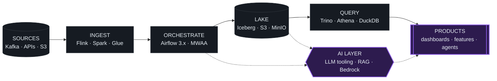

<!-- ============================================================ -->
<!-- VARIANT 04 — HYBRID (Data-viz + Terminal headers)            -->
<!-- ============================================================ -->

<h1>Avik Mandal &nbsp;// Data Engineer → Data + AI Engineer</h1>

Bangalore, India &nbsp;•&nbsp; Shipping data platforms since 2012 &nbsp;•&nbsp; Building with AI, building for AI

  
  

---

### `~/flow` &nbsp;how the work flows

<i>The solid path is where I've lived for a decade. The dotted path is where I'm building next.</i>

---

### `~/focus` &nbsp;right now

| | |
|---|---|
| **Platform work** | Airflow 3.x · Kubernetes · Iceberg + Trino lakehouse patterns |
| **AWS** | MWAA · EMR · Glue · Athena · S3 · Lambda · ECS |
| **AI in the loop** | Using AI across the dev cycle — design, code, review, docs |
| **AI in the product** | Shipping features where AI measurably improves UX |
| **Learning** | AWS Data Engineer cert · Go for backend services · model serving |

---

### `~/projects` &nbsp;pinned

<table>
<tr>
<td width="50%" valign="top">

**[local-infra-setup](https://github.com/avikbesu/local-infra-setup)**
Local dev infra with all services wired together.
`Shell` · `Docker` · `Makefile`

</td>
<td width="50%" valign="top">

**[airflow3-dags](https://github.com/avikbesu/airflow3-dags)**
Production-style DAG patterns exploring Airflow 3.x.
`Python` · `Airflow 3.x`

</td>
</tr>
</table>

---

### `~/stack` &nbsp;by layer

<table>
<tr><td><b>ORCHESTRATION</b></td><td>

</td></tr>
<tr><td><b>AWS</b></td><td>

</td></tr>
<tr><td><b>INFRA</b></td><td>

</td></tr>
<tr><td><b>LANGUAGES</b></td><td>

</td></tr>
<tr><td><b>DATA</b></td><td>

</td></tr>
<tr><td><b>AI / ML</b></td><td>
upskilling →

</td></tr>
</table>

---

### `~/stats` &nbsp;github signal

  
  

---

### `~/talks` &nbsp;speaking & open source

<table>
<tr>
<td width="33%" valign="top">

#### 🎤 Speaking

<b>Airflow DAG patterns at scale</b>
Internal tech talks — production-grade orchestration, failure modes, observability.

<b>Data platform case studies</b>
Lakehouse architecture, cost/perf trade-offs. Available on request.

<a href="https://www.linkedin.com/in/avikmandal/">→ Invite me to speak</a>

</td>
<td width="33%" valign="top">

#### 🌱 Open Source

<b>Airflow community</b>
Contributing around Airflow 3.x patterns, providers, and dev ergonomics.

<b>Local-dev tooling</b>
<a href="https://github.com/avikbesu/local-infra-setup">local-infra-setup</a> — batteries-included dev stack.

<a href="https://github.com/avikbesu?tab=repositories">→ All repositories</a>

</td>
<td width="33%" valign="top">

#### ✍️ Writing

<b>Production DAG patterns</b>
Notes on idempotency, backfills, and observability in Airflow.

<b>AI-augmented engineering</b>
What actually moves the needle in the daily dev loop.

<a href="https://www.linkedin.com/in/avikmandal/">→ Posts on LinkedIn</a>

</td>
</tr>
</table>

---

### `~/ask-me-about`

`Apache Airflow` &nbsp;·&nbsp; `Data pipeline design` &nbsp;·&nbsp; `Kubernetes for data` &nbsp;·&nbsp; `Data lake architecture` &nbsp;·&nbsp; `AWS data stack` &nbsp;·&nbsp; `AI-augmented development` &nbsp;·&nbsp; `Shipping AI features in data products`
